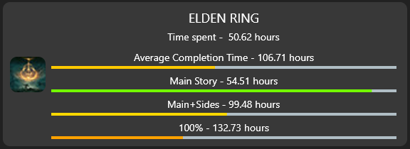

# SteamTimeSpent

Projekt Flutterowy pozwalający na podejrzenia przybliżonych statystyk ukończenia gier obecnych na danych koncie Steam.

## Opis projektu

Aplikacja opiera się na wykorzystaniu zapytań http do pobierania danych z *api.steampowered.com* i *howlongtobeat.com/api/search*. Po podaniu poprawnego *SteamID64*, aplikacja wysyła zapytania o listę wszystkich gier oraz tych granych w ciągu ostatnich 2 tygodni do *Steam API*. *Steam API* zwraca te listy, gdzie każdy wpis zawiera całkowity czas spędzony w danej grze. Następnie, wykorzystując tytuły zwróconych gier, wysyłane są po kolei zapytania typu POST do *howlongtobeat.com/api/search*. Każde takie zapytanie zawiera jeden tytuł, ponieważ API to działa w formie wyszukiwarki. Zwracana jest lista gier pasujących podanym tytułem. Zdając się na poprawność działania strony, wybierany jest zawsze pierwszy wpis ze zwróconej listy. Ponieważ każde tego typu zapytanie pozwala wyszukać dane dla jednego tytułu, dla kont zawierających kilkadziesiąt gier, pobranie danych może być czasochłonne.
Wpisy zwrócone przez *howlongtobeat API* zawierają zamieszczone przez użytkowników średnie czasy ukończenia danego tytułu na 4 różne sposoby: czas ukończenia jedynie głównego wątku fabularnego, ukończenie wątku głównego oraz znacznej części wątków pobocznych, otrzymanie wszystkich dostępnych osiągnięć, oraz uśrednienie czasów z poprzednich 3 kategorii. Statystyki wyświetlane na ekranie po wczytaniu profilu odpowiadają wyżej wymienionym kategoriom, porównując czas spędzony w grze przez danego użytkownika z czasami pobranymi z *howlongtobeat*.
Wczytane profile są zapisywane do pliku z listą ostatnich wyszukiwań, co ułatwia wielokrotne podgladanie statystyk dla 10 ostatnio wyszukanych profilów.

## Instrukcja

Ekran startowy, dostępny zaraz po włączeniu aplikacji, zawiera kilka możliwości przejścia dalej:
- Wpisanie 17-cyfrowego *SteamID64* użytkownika w pole tekstowe, którego statystyki pragniemy zobaczyć. Jeśli ID będzie niepoprawne, nie przejdziemy do ekranu statystyk, a na górze ekranu zostanie wyświetlony komunikat o błędzie (komunikaty o błędzie niekoniecznie będą pomocne),
- Kliknięcie *How to find your SteamID64* przeniesie użytkownika na ekran zawierający kilka sposobów na znalezienie ID konta, potrzebne do wyświetlenia statystyk,
- Jeśli wcześniej wprowadziliśmy poprawne *SteamID64*, na dole ekranu startowego będzie wyświetlone do 10 ostatnio wyszukanych profilów. Kliknięcie w jeden z nich spowoduje wczytanie statystyk dla danego konta, ułatwiając podglądanie danych dla często wyszukiwanych profilów.
Dane ostatnich wyszukiwań zapisywane są do pliku. W systemie Windows można je znaleźć w folderze Dokumenty.

Po wpisaniu poprawnego *SteamID64*, lub wybraniu profilu z Ostatnio Wyszukanych, aplikacja przejdzie do ekranu statystyk. Na górnym pasku wyświetlony zostanie awatar użytkownika oraz nazwa jego profilu.
Statystyki wyświetlone są w postaci dwóch list. Zakładka *Recent Games* zawiera gry, w które użytkownik grał w ciągu ostatnich 2 tygodni (możliwe, statystyki z tych gier będą go bardziej interesować). Zakładka *All Games* zawiera wpisy dla wszystkich gier obecnych na koncie.
Domyślne gry wyświetlane są w kolejności, w jakiej pojawiły się w odpowiedzi *Steam API*. W tej kolejności wysyłane będą zapytania do *howlongtobeat*.
Możliwe jest posortowanie list na jeden z 4 sposobów:
1. Alfabetycznie - A do Z,
2. Alfabetycznie z odwróconą kolejnością - Z do A,
3. Po całkowitym czasie spędzonym w grze wg Steam - malejąco,
4. Po całkowitym czasie spędzonym w grze wg Steam - rosnąco.
Dla większych zbiorów gier sortowanie może potrwać kilka sekund.

### Kompozycja wpisu
Pojedynczy wpis w liście statystyk składa się z następujących elementów:
- Ikony gry (po lewej stronie)
- Tytułu
- Całkowitego czasu gry, policzonego przez platformę Steam (*Time spent*)
- 4 pasków z tytułami, przedstawiającymi oczekiwane poziomy ukończenia gry
    - Średni czas ukończenia - wszystkie style gry
    - Główny wątek fabularny
    - Główny wątek + większość wątków pobocznych
    - Zdobycie wszystkich osiągnięć
Nad każdym paskiem wyświetlony jest jego tytuł, a obok niego znajduje się średni czas ukończenia gry w dany sposób.
Poziom wypełnienia oraz kolor paska pozwala na przybliżenie poziomu ukończenia - niski poziom ukończenia przedstawiany jest paskiem wypełnionym w małym stopniu oraz kolorem czerwonym. Im bliżej dany czas odpowiada średniemu czasowi ukończenia, tym pasek jest bardziej wypełniony, oraz zmienia kolor na pomarańczowy, a później na zielony.
Dla czasów gry powyżej średniego czasu ukończenia, pasek postępu będzie całkowicie wypełniony, a jego kolory mogą wkroczyć na terytorium barw niebieskich, fioletowych, a w końcu z powrotem do czerwonych (kolory zmieniają się wg schematu barw HSL).

Bezpośrednio po wczytaniu poprawnego profilu Steam, aplikacja rozpoczyna ładowanie statystyk dla każdej gry. Lista będzie się dynamicznie aktualizowała, by pokazać postęp ładowania. Wpisy oczekujące na dane od *howlongtobeat* oznaczone będą okręgiem sygnalizującym ładowanie, a wpisy załadowane pokazują statystyki w sposób opisany wyżej.
Może się zdarzyć, że przez specyficzny zapis tytułu w bazie danych Steam, lub brak danych na stronie *howlongtobeat*, statystyki dla danej gry nie zostaną znalezione. Wtedy wpis dla takiej gry zostanie wyświetlony z tekstem *Game not found on HowLongToBeat.com*.

### Testowanie we własnym zakresie
Jeśli użytkownik aplikacji nie posiada konta Steam, może przetestować działanie na przykładowym koncie o *SteamID64* równym 76561198127214494.